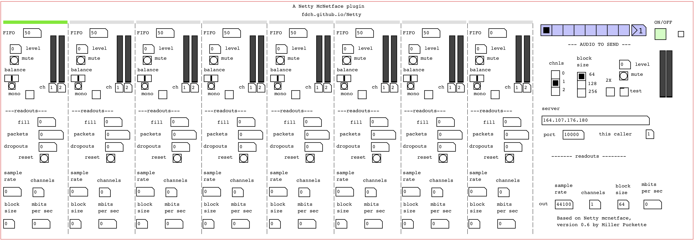

# Netty

A VST VERSION OF Miller Puckette's NETTY MCNETFACE -- MULTI-SITE ENSEMBLE AUDIO USING A CENTRAL PACKET REPEATER. 

Head to the [releases](https://github.com/fdch/Netty/releases) pages to get the builds.

Version: 0.1
Author: ffddcchh

Based on [quacktrip\~](http://msp.ucsd.edu/tools/quacktrip/) by Miller Puckette. Made with [Camomile](https://github.com/pierreguillot/Camomile) by Pierre Guillot.

Many thanks to Miller Puckette and the Pure Data team, 
Marc Ainger for testing and support, 
and Pierre Guillot for Camomile.

---

# instructions (ver abajo para español)

## puredata

1. unzip the zip file
2. open with Pure Data the file `Netty.pd` located in the folder `src/Netty/`

## plugin

1. unzip the zip file
2. load the VST (or AU in macos) from your DAW (Ableton, Max, Reaper, etc)

## how to use

See the readme in `src/Netty/README`